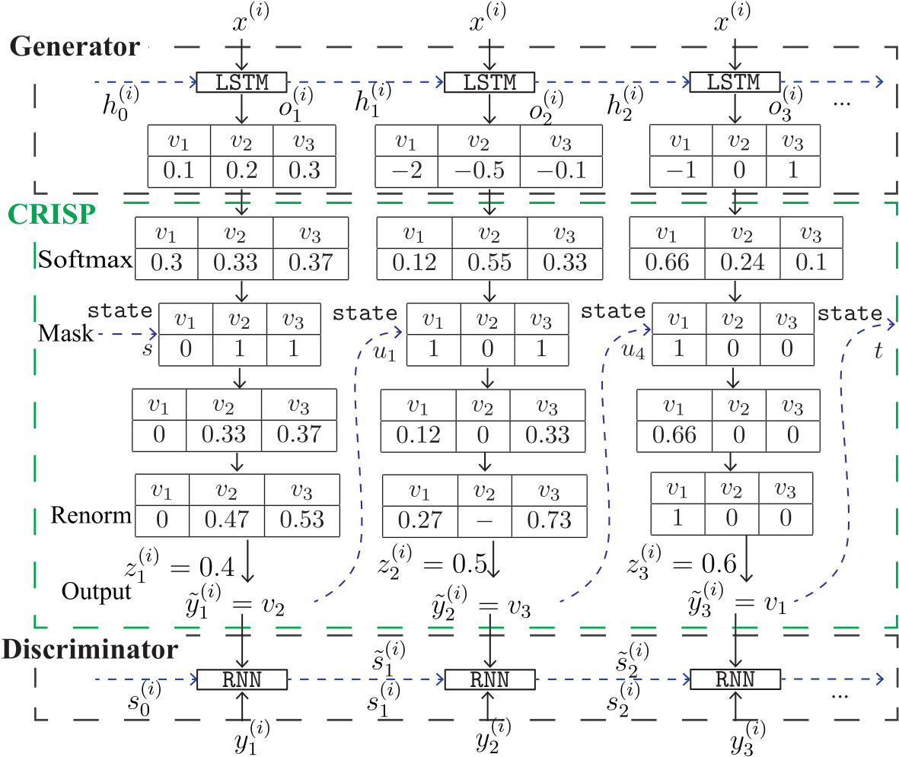
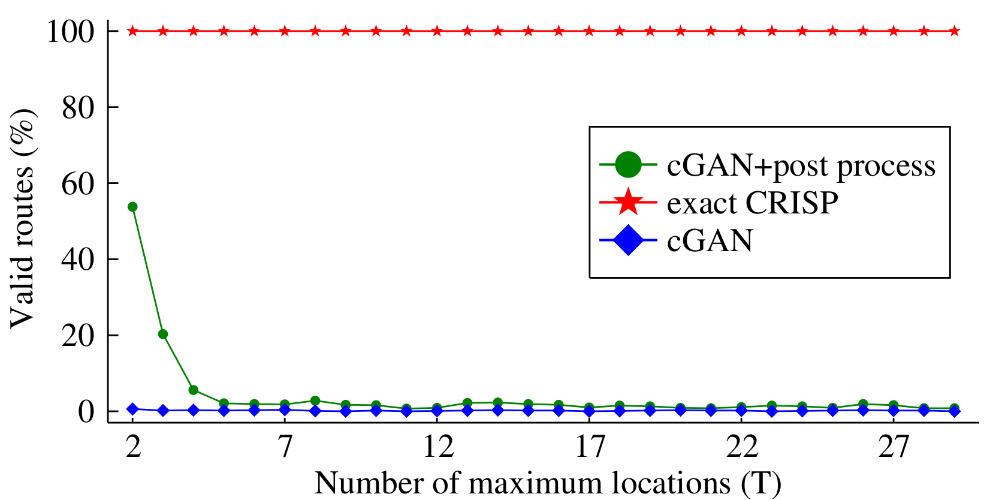

## Constraint Reasoning Embedded Structural Prediction
Welcome to the Code part for reproducibility. We summarize our experiment implementations in this pages.

### Vehicle Dispatching Service Planning

#### Problem Descriptions

A route planning problem which recommends routes to drivers to meet the service needs while satisfying the drivers' preferences. Such preferences are learned from the historical traveling data. The input of this problem are the daily service requests. The output are the permutations of the service locations, representing the order that the locations should be visited. This task requires a tight integration of machine learning to capture drivers' preferences, and constraint reasoning to ensure the satisfaction of service requests. 

#### Neural Network Structure and Implementations

We use the same neural network as the Xue et. al. paper (Embedding Decision Diagrams into Generative Adversarial Networks), which is shown in the following figure. Check the detailed implementation at: [Link the to the code repository](https://github.com/jiangnanhugo/route-planning)

#### Experimental Comparison

We evaluate the performance of the neural network with and without CRISP module  generating valid routes over all the synthesized datasets. We also include a post processing method for the neural network output without CRISP to show the performance of an ad-hoc modification approach. As shown in the following figure, the baseline can only generate around 0.1% of valid routes. From our manual inspection, the generated routes are more likely to visit one place more than once. The post processing method uses a mask vector to enforce that the model can only visit the locations in the daily requested set, and then it removes all the duplicates in the output schedule. Once we apply the post processing method on the output generated by the baseline, the model's performance is improved to 50% for the dataset T=2. However, the post processing method cannot handle the combinatorial complexity of the dispatching problem, as it quickly falls close to the baseline's performance when we increase the number of locations in daily requested set. As a contrast, the percentage of valid-routes are always 100%  when we apply the exact CRISP module.

### If-then Program Synthesis

#### Problem Descriptions

The task is to automatically synthesize conditional programs from the natural language. Automatic program synthesis tools are useful to streamline the program of a few online services such as IFTTT and Zapier. The if-then program is in the form of:  if `trigger function` happens in the `trigger service`, then take the `action function` from the `action service`.  The machine learning task therefore is to predict the quadruple (`trigger service, trigger function, action service, action function`).  This application again requires machine learning to understand natural language, as well as constraint reasoning to satisfy the syntactic rules of the programs.

#### Neural Network Structure and Implementations

Our neural network is based on the LatentAttention model (Latent Attention For If-Then Program Synthesis), which is shown in the following figure. Check the detailed implementation at: [Link the to the code repository](https://github.com/jiangnanhugo/if-then-program-synthesis)

#### Experimental Comparison

In this experiment, we start with evaluating the percentage of valid programs generated from the baseline without the CRISP module. Then we apply the CRISP module from the proposed iterative search algorithm, which iteratively relax the MDDs until we arrive at the exact MDD. The results in the following figure shows the performance of all the relaxed and the exact CRISP modules when added to the baseline, LatentAttention.  Among all programs produced by the LatentAttention without a CRISP layer,  around 88% of them are valid on the two datasets. Once we enforce the exact CRISP capturing the `Functionality` constraint, all the programs (100%) produced are valid. We also study the effect of restricting the layer width of MDDs used in CRISP. We use the proposed iterative search algorithm to experiment CRISP with MDDs generated from width-2 to the largest width, which is width-111 for IFTTT and width-1353 for Zapier. The valid programs results on a separate testing set is shown in the blue curves.  The performance with relaxed CRISP rises gradually with the increase of the MDD's width. 

Finally, We collect the results of the LatentAttention without CRISP, the model with the `best relaxed` CRISP model and with `the exact` CRISP model on two datasets in the following table. The `best relaxed` CRISP model achieves 1-2% higher accuracy than the LatentAttention baseline and still generates around 11% more valid programs than the LatentAttention. Similarly, the model with the exact CRISP module improves approximately 1% in accuracy but generates 100\% valid programs.

| Dataset |IFTTT|IFTTT|IFTTT|Zapier|Zapier|Zapier|
| ------------------ | ----- | -------- | -------------- | ----- | -------- | -------------- |
| Metrics | Width | Accuracy | Valid Programs | Width | Accuracy | Valid Programs |
| ------------------ | ----- | -------- | -------------- | ----- | -------- | -------------- |
| LatentAttention    | 1     | 42.17%   | 87.51%         | 1     | 31.74%   | 88.00%         |
| Best Relaxed CRISP | 80    | **44.12%** | 99.19%         | 1200  | **34.28%** | 99.53%         |
| Exact CRISP        | 111   | 43.07%   | **100%**       | 1353  | 32.83%   | **100%**       |

### Text2SQL Generation

#### Problem Descriptions

Formatted data such as travel records and stock market transactions are stored in the relational databases. Currently, accessing the database requires a data scientist who masters the SQL query language. Our task is to automatically synthesize SQL queries from natural language sentences using machine learning. Compared with the previous task, SQL query generation requires deeper reasoning across the structure of the database, the semantics of the structured query language, and the understanding of natural language. The input of the text2SQL generation is a sentence that describe the query in natural language and the table headers in the relational database and the output is a SQL query.

#### Neural Network Structure and Implementations

Our neural network is based on the SQLNova model. Due to the complexity of the neural network framework, we do not show the visualized framework here. Please check the detailed implementation at: [Link the to the code repository](https://github.com/jiangnanhugo/sqlova-with-dataype-constraint)

#### Experimental Comparison

CRISP leads to 100% valid SQL queries generated and increases in both the execution accuracy and the logical accuracy for the Text2SQL generation task. The SQLNova model is a baseline model without the CRISP module embedded.

|             | Execution Accuracy | Logical Accuracy | Valid SQL |
| ----------- | ------------------ | ---------------- | --------- |
| SQLNova     | 85.1%              | 79.1%            | 99.3%     |
| Exact CRISP | 85.8%              | 80.0%            | 100%      |

